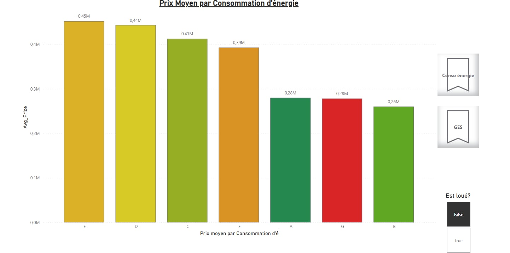

# 🇫🇷 ImmoViz – Real Estate Data Pipeline & Interactive Dashboards
Real Estate Market Analysis: Energy Performance & Pricing Insights

## 1 • Project Overview (TL;DR)

### Business Question
To what extent does the energy class (DPE & GES) of a property influence its sale price or rental rate?

**ImmoViz** is a real-time data processing pipeline that:

- **Collects** real estate listings (web scraping + DVF open data)
- **Cleans & standardizes** records in a Kafka stream
- **Processes** messages in parallel using Spark Streaming
- **Stores** analysis-ready data in PostgreSQL
- **Exposes**:
  - Interactive Power BI dashboards (price ↔ energy classes, maps, correlations...)
  - Grafana monitoring (scraping health, latency, throughput)

### ⚖️ Legal Notice
Web scraping of third-party sites is prohibited without their explicit consent.
This project is strictly academic.
If you wish to collect this data: contact the platforms directly.

## 2 • Dashboard Results Overview




*(Complete screenshots available in `docs/screens/`)*

## 3 • Architecture Overview

### Pipeline Summary:
| Stage | Technology | Role |
|-------|------------|------|
| 1. Scrapers (BienIci, Logic-Immo, Entreparticuliers) | Scrapy + Python | Push raw listings to MongoDB + send fetching report |
| 2. Scheduler | Python app | Every 5 min, reads new Mongo listings ➜ `property-ads` topic |
| 3. DVF Producer | Python + ThreadPool | data.gouv API ➜ `dvf-property-ads` topic (50 partitions) |
| 4. Kafka | Bitnami Kafka | Event streaming (2 topics, 60 total partitions) |
| 5. Spark Streaming | 3 workers × 4 cores | Consumes both topics, cleans, filters, calculates, publishes analysis report |
| 6. FastAPI | immo-viz-api | Inserts property_ads & reports into Postgres |
| 7. Storage | PostgreSQL | immo-viz-db (analysis data) and immo-monitoring-db (health) |
| 8. Visualization | Power BI (reader) | Direct queries on immo-viz-db |
| 9. Monitoring | Grafana | Dashboards: scraping velocity & processing latency |

## 4 • Detailed Workflow

<details>
<summary>🗂️ Click for step-by-step breakdown</summary>

### 4.1 Web Scraping
- **Scrapy spiders** (`immoscraper/spiders/...`) collect:
  - Property type, surface area, price, coordinates, DPE class, GES rating...
- **Temporary storage** in MongoDB (`src_property_ads`)
- **Scrapy extension** sends a `fetching_report` (success rate, duration, item count)

### 4.2 Scheduling
- **analysis-scheduler** service ➜ every `START_SCHEDULER_INTERVAL` seconds (env: 300s)
- Reads MongoDB, only sends listings newer than last analysis (`last_seen` field)
- Publishes to Kafka ▶ `property-ads` topic (10 partitions)

### 4.3 DVF Producer
- **Multi-threaded** (up to `DVF_PRODUCER_MAX_WORKERS`)
- Calls DVF/Etalab API, cleans data, maps Apartment ⇢ 1 / House ⇢ 2...
- Publishes to `dvf-property-ads` (50 partitions)

### 4.4 Spark Processing
- `consumer.py` submitted to cluster (spark-submit equivalent)
- **Streaming** reads from both topics → micro-batches ~100ms
- **Cleaning & filtering**:
  - Numeric types; thresholds (price, surface, rooms); non-finite values; enum mapping; add `inserted_at`
- **Randomly calculates** plausible DPE/GES if missing (for DVF data)
- **POST** to `/property_ads` + `/analysis_reports`

### 4.5 Storage & Visualization
- **immo-viz-db**: tables `region`, `department`, `city`, `property_ad`
- **Power BI** reads directly (import mode or direct query)
- **immo-monitoring-db** stores `fetch_reports`, `analysis_scheduler_reports`, `analysis_reports`
- **Grafana** monitors end-to-end health (latency, error rates, batch duration...)

</details>

## 5 • Technology Stack

| Domain | Tools |
|--------|-------|
| Data Collection | Scrapy, Python 3.11 |
| Event Streaming | Kafka (Bitnami latest) |
| Stream Processing | Apache Spark 3.5 (Streaming) |
| Databases | MongoDB 5 • PostgreSQL 16 |
| API & ETL | FastAPI, SQLAlchemy |
| Monitoring | Grafana |
| Orchestration | Docker Compose + Makefile |
| Business Intelligence | Power BI Desktop / Service |

## 6 • Quick Installation

### 6.1 Prerequisites
- Docker 20+ and Docker Compose v2
- ~8GB free RAM (scraping + Spark workers)
- Power BI Desktop (to open .pbix files) – optional in Service mode

### 6.2 Clone & Configuration
```bash
git clone https://github.com/your-org/immoviz.git
cd immoviz
cp .env.example .env          # then adjust variables if needed
```

### 6.3 Launch Full Stack
```bash
# compile images, start Spark cluster with 3 workers × 4 cores
make up         # or: docker compose up --build --scale spark-worker=3
```

**Access services:**

| Service | Default URL |
|---------|-------------|
| immo-viz-api | http://localhost:8000/docs |
| Grafana | http://localhost:3000 (admin / admin) |
| Spark UI | http://localhost:8081 |
| Mongo Express (optional) | — |
| Power BI | open `Viz_immo_Final.pbix` (local connections) |

### 6.4 (Optional) – Import Geodata
The `immo-viz-db` database already contains `region`, `department`, `city` tables.
To regenerate:

```bash
docker exec -it $(docker compose ps -q immo-viz-api) \
  poetry run python -m immo_viz_api.seeder
```

### 6.5 Stop & Clean
```bash
make down       # stop containers
make clean      # stop + remove volumes
```

## 7 • Main Environment Variables

| Key | Default | Description |
|-----|---------|-------------|
| `SCRAPER_KAFKA_PARTITIONS` | 10 | Partitions for `property-ads` topic |
| `DVF_KAFKA_PARTITIONS` | 50 | Partitions for `dvf-property-ads` topic |
| `SPARK_WORKER_REPLICAS` | 3 | Number of worker containers |
| `SPARK_WORKER_CORES` | 4 | CPU allocated per worker |
| `START_SCHEDULER_INTERVAL` | 300 | MongoDB polling frequency (seconds) |
| ... | ... | See `.env.example` |

## 8 • Limitations & Improvement Ideas

- **Scraping blocked** ↔ CAPTCHA / robots.txt: switch to official APIs or Scrapoxy/rotating-proxies
- **Missing DPE/GES** for DVF → prediction model possible
- **Security**: implement auth & RBAC on FastAPI + Kafka encryption (SASL / TLS)
- **CI/CD**: GitHub Actions → Docker Hub → Production k8s

## 9 • Legal Disclaimer

This repository is provided for educational purposes (MS Big Data 2025).
Any production use, massive scraping, or data commercialization must comply with:

- **Terms of Service** of scraped sites (BienIci, PAP, Logic-Immo, EntreParticuliers)
- **data.gouv.fr license conditions** for DVF data
- **GDPR** (no personal data should be collected)

## 10 • Project Structure

```
immoviz/
├── docker-compose.yml          # Main orchestration file
├── Makefile                    # Shortcuts for common commands
├── .env.example               # Environment variables template
├── docs/
│   └── screens/              # Dashboard screenshots
├── immoscraper/              # Scrapy project
│   ├── spiders/              # Web scrapers
│   └── pipelines.py          # Data processing pipelines
├── immo-viz-api/             # FastAPI service
│   ├── models/               # SQLAlchemy models
│   ├── routers/              # API endpoints
│   └── seeder.py             # Geodata seeder
├── spark-jobs/               # Spark Streaming applications
│   └── consumer.py           # Main streaming consumer
├── analysis-scheduler/       # MongoDB to Kafka scheduler
└── dvf-producer/            # DVF data producer
```

## 11 • API Endpoints

### Property Data
- `POST /property_ads` - Insert processed property listings
- `GET /property_ads` - Retrieve property data with filters

### Analysis Reports
- `POST /analysis_reports` - Insert analysis results
- `GET /analysis_reports` - Retrieve analysis metrics

### Health Monitoring
- `POST /fetch_reports` - Scraping health reports
- `GET /health` - Service health check

## 12 • Data Schema

### Property Ad
```sql
CREATE TABLE property_ad (
    id SERIAL PRIMARY KEY,
    property_type INTEGER,
    surface FLOAT,
    price FLOAT,
    rooms INTEGER,
    dpe_class VARCHAR(1),
    ges_class VARCHAR(1),
    latitude FLOAT,
    longitude FLOAT,
    city_id INTEGER,
    inserted_at TIMESTAMP
);
```

### Geographic Data
```sql
CREATE TABLE region (id INTEGER, name VARCHAR, code VARCHAR);
CREATE TABLE department (id INTEGER, name VARCHAR, code VARCHAR, region_id INTEGER);
CREATE TABLE city (id INTEGER, name VARCHAR, postal_code VARCHAR, department_id INTEGER);
```

## 13 • Performance Metrics

- **Throughput**: ~1000 properties/second (3 Spark workers)
- **Latency**: <200ms end-to-end processing
- **Storage**: ~50MB/day for typical workload
- **Scraping Rate**: ~500 listings/minute across all sources

---

**Built for MS Big Data 2025**